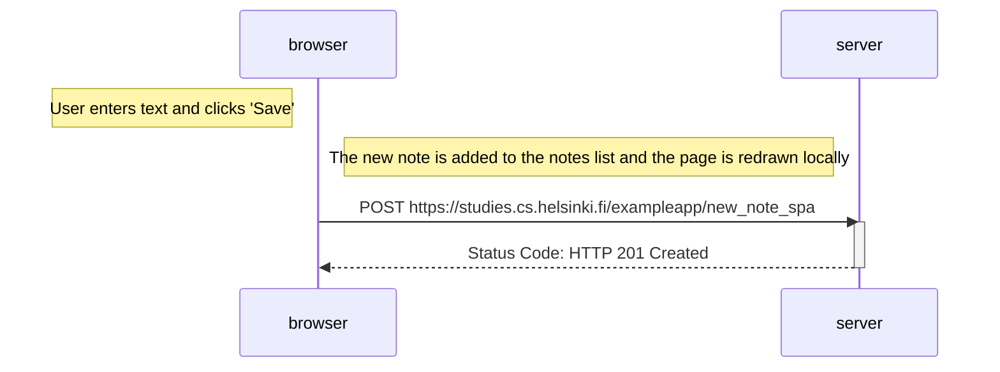

```mermaid
sequenceDiagram
    participant browser
    participant server

    Note left of browser: User enters text and clicks 'Save'
    Note right of browser: The new note is added to the notes list and the page is redrawn locally
    browser->>server: POST https://studies.cs.helsinki.fi/exampleapp/new_note_spa

    activate server
    server-->>browser: Status Code: HTTP 201 Created
    deactivate server
```